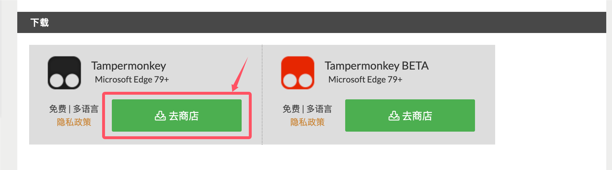

# 基于 TemperMonkey 的网页版天凤 pt 隐藏插件

此插件是为了作者和其他的一些心态受到 pt 影响的雀士准备的。本插件的作用是将当前 pt 替换为 `xxxx`

最终效果是这样：


# 部署说明

## 第一步 添加 TemperMonkey 插件

前往 TemperMonkey 官网 （ https://www.tampermonkey.net/ ）并找到自己的浏览器类型下载 TemperMonkey 插件：





## 第二步 添加脚本

在浏览器右上角查看当前插件，找到篡改猴并选择添加新脚本。


接下来将以下脚本复制进编辑框，之后按下 CTRL + S 保存脚本。

```javascript
// ==UserScript==
// @name         天凤PT点数隐藏
// @namespace    http://tampermonkey.net/
// @version      0.1
// @description  在天凤网站隐藏自己的PT点数，显示为xxxx
// @author       gzchenben
// @match        https://tenhou.net/*
// @match        http://tenhou.net/*
// @grant        none
// ==/UserScript==

(function() {
    'use strict';

    // 定义PT点数的选择器
    const PT_SELECTOR = 'table[align="right"] tr td:nth-child(5)';

    // 主函数，用于隐藏PT点数
    function hidePt() {
        // 获取所有PT点数元素
        const ptElements = document.querySelectorAll(PT_SELECTOR);

        // 遍历所有找到的元素并替换内容为"xxxx"
        ptElements.forEach(element => {
            if (element.textContent.trim() !== 'xxxx') {
                element.textContent = 'xxxx';
                // 可选：添加样式使显示更自然
                element.style.minWidth = '40px'; // 保持宽度一致
                element.style.display = 'inline-block';
                element.style.textAlign = 'center';
            }
        });
    }

    // 初始执行
    hidePt();

    // 使用MutationObserver监听DOM变化，以防PT点数动态加载
    const observer = new MutationObserver(function(mutations) {
        hidePt();
    });

    // 开始观察整个文档的动态变化
    observer.observe(document.body, {
        childList: true,
        subtree: true
    });

    // 可选：每隔一段时间检查一次，确保PT点数被隐藏
    setInterval(hidePt, 1000);
})();
```

## 第三部 设置开发者模式

点击篡改猴插件右边的 "..." ，点击管理扩展，然后开启开发人员模式。


## 部署完成

部署完成，接下来打开 tenhou.net/4/ 查看效果吧～
